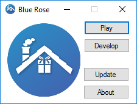

# Blue Rose Classic

Blue Rose Classic was a now-defunct launcher written in C# and Windows Forms. It was originally designed to address a gap that appeared when Project Dollhouse, an open-source Sims Online reverse engineering project, changed direction under new leadership and became FreeSO. Despite being a small and straightforward application, Blue Rose had to manage a lot of complexity behind the scenes.

The project started after the official Project Dollhouse launcher was abandoned due to changes in its development strategy. With updates coming in rapidly and no streamlined way to manage them, many—myself included—were left manually downloading ZIPs. Recognizing this frustration, I took it upon myself to create Blue Rose. While the code wasn't pretty, it did exactly what it needed to, and that was enough for me.

However, things took a turn when I tried to implement native unzipping, which ended up breaking FreeSO. This led me to put the last stable release that used DotNetZip into long-term support. To make matters worse, vague rules around screenshots (don’t ask) led to my ban from the community, forcing me to abandon a project that many had come to rely on.

Blue Rose taught me to always ensure reliability from the very first release.